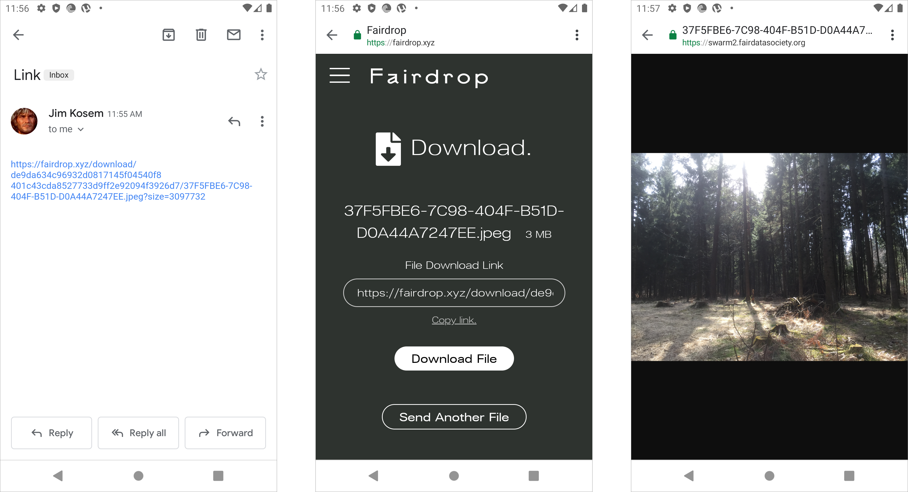

# Fairdrop



> An easy and secure way to send your files. No central server. No tracking. No backdoors.

## Sharing

Fairdrop is a web \(mobile and desktop\) app where the user can send files either encrypted or unencrypted.

‌After choosing to send the file unencrypted the user needs to select the file on the device, they are sharing from. If the user selects the encrypted method of file transfer, they need to create a mailbox which requires an account.

‌The user loads the file from their device \(here using Firefox iOS\) which shows the confirmation screen showing the file URL, its file size and then the option to send or cancel the send. The user then sees the confirmation screen on their device and the link for the other user to download the file by copy/pasting the link and then sending it through whichever method they choose.

The other user opens that link in a browser \(Chrome, Android\) and they see the file options to download that file. The file then can be viewed or downloaded to the device.

