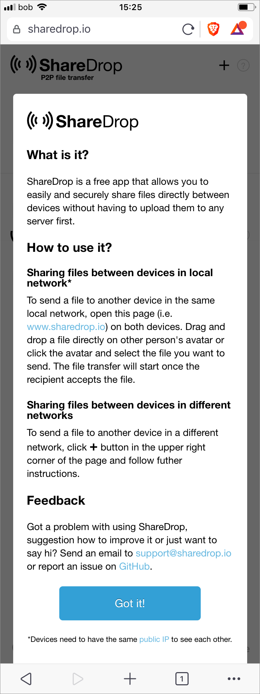
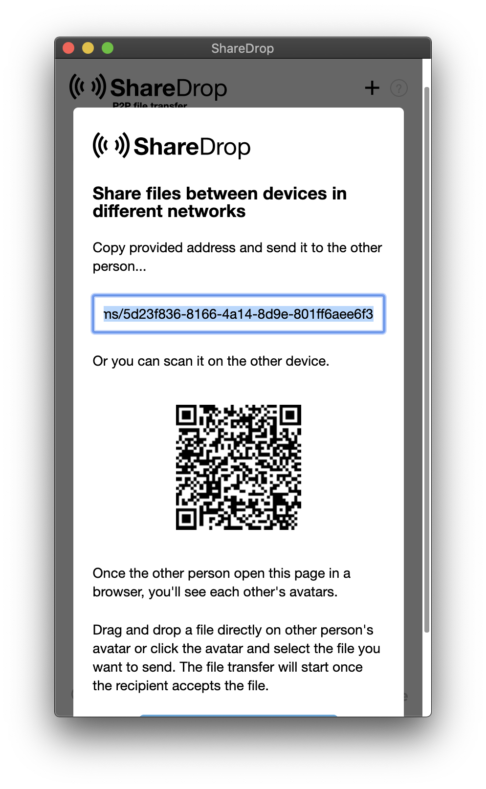

# Sharedrop.io



> **ShareDrop** is a peer-to-peer file sharing app powered by HTML5 WebRTC.

## Sharing

ShareDrop is a web application that also works on mobile web. For testing purposes, it was used on Brave \(desktop/mobile\) and Safari \(mobile\).

The user is prompted with a modal showing how to use the app which they have to approve to continue.

On the sharing mobile \(in this case, desktop simulation in Brave\) any user with SharePoint open on the network shows as an animal avatar. In this case, it shows the two test devices.

The connection verification between the two devices sharing is initiated by the device receiving the shared file by showing a QR code which the other device needs to read to verify. Alternately, the user can copy and send a code.

The connection is then verified. At that point the user clicks the avatar of the device they want to share with and then are given a system prompt to load the file to send.

The device sending the file has to confirm the share.

There is then a notification showing the device is waiting for the share to be accepted and transfer.

On the receiving device, the user then receives a notification to Decline or Save the file sent.

