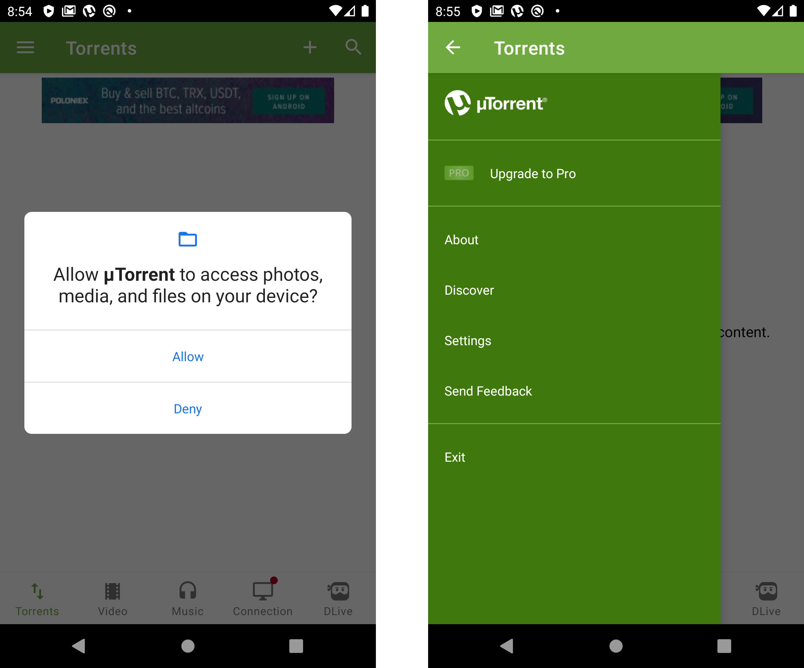
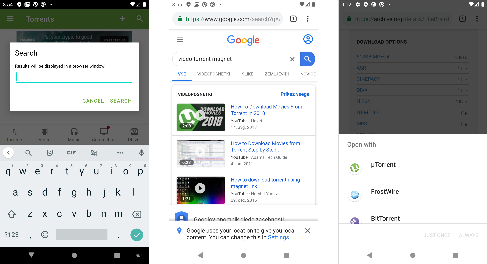
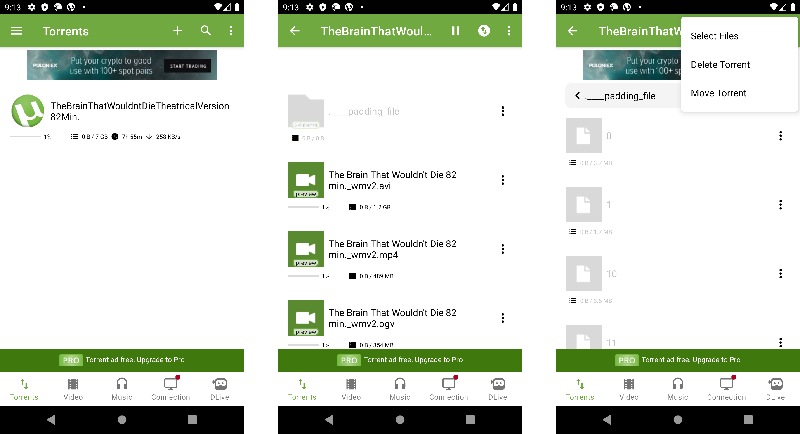

# uTorrent Mobile



> **Search**
>
> Use your browser to find torrent files and magnet links.
>
> **Download**
>
> Open these files and links in uTorrent Mobile to quickly and efficiently download your torrents.
>
> **Enjoy**
>
> Easily play back your music and audio files using the integrated media player.

## Setup

Setup is instant when installing the Android app and immediately goes to a confirmation screen to access local media. The main navigation features prominently the option to upgrade to the paid version.

## Download

The Search option in the upper global navigation opens a dialogue which the user would assume searches for torrents in the app. Instead, Search opens a Google search of the search string entered in the dialogue. If there are any torrent clients installed on the Android device, a system dialogue opens that link in choice of apps on the device.

The Torrents screen shows the torrent downloading and the pertinent info. Then, when the user selects the torrent, all of the files are displayed. When managing any of the torrent shares with the overflow menu, the user can choose the files comprising the torrent, delete it or move the torrent.

