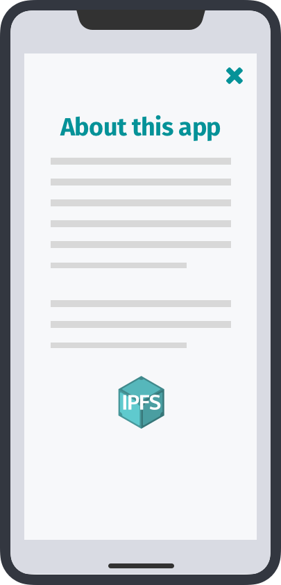
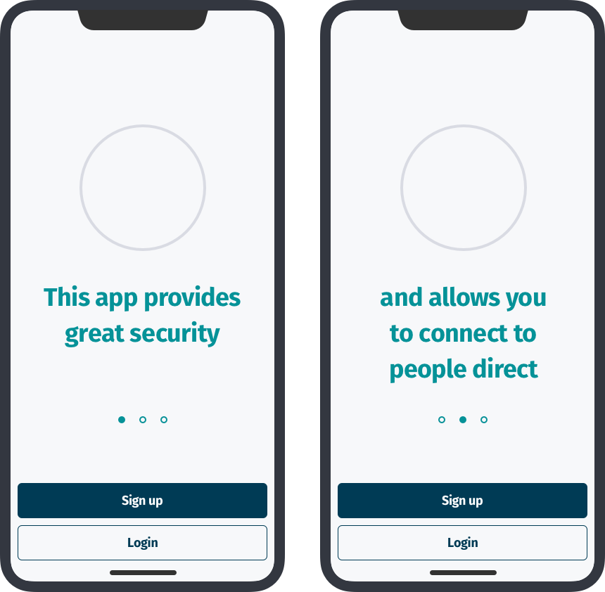

# Make IPFS invisible most of the time

The user does not need to know that they are even using IPFS, or even P2P for that matter. What they need to be aware of through their use, is that something built to work with IPFS benefits them in terms of security, speed potentially and control.

## What the research points to

* Users don't typically concerned about how an app or service works, just that it does and does well
* Mobile users have a great deal of cognitive load when using apps from multiple and sometimes competing notifications and pervasive partial attention

## What to think about

IPFS is a file system. Most users don't have many day to day concerns about what file system they are using, just that it works and works how they want it to.

IPFS should be the secure and dependable basis your app or service relies on that hums surely and quietly in the background. It is there to provide many key and unique benefits other apps don't which should be highlighted, but out of the way.

## Patterns

### **Highlight you're using IPFS but not overtly**

Mobile apps and services typically have short but frequent interaction periods. If it is not a reading or research app, you should not have a lot for them to read. The user has a small screen and not a lot of time, so put additional or technical information somewhere accessible but out of the way.

IPFS is a relatively new technology and difficult to understand. P2P is much older but not prevalent in conversation even in technical contexts. The user can be made aware they are using it, but they shouldn't be necessarily reminded of it.

| ✅ Do | 🚫 Don't |
| :--- | :--- |
| Show that your app or service is using IPFS in the information or credits screen | Show lots of information about the underlying protocols |
| Show the IPFS logo and "Made with IPFS" in the info or credits screen | Have in-depth explanations of how IPFS works in main transactional screens |

_Info or About screens are good places to provide information about IPFS_

### **Don't show too much about the underlying technology during onboarding**

App developers are appropriately concerned about the their development stacks, how they function and what unique qualities they bring to the app the user is using. Many times developers provide too much of the information about the underlying technology they're concerned with when explaining the benefits of the app to their users.

| ✅ Do | 🚫 Don't |
| :--- | :--- |
| Explain quickly in onboarding that the app uses IPFS | Go into explicit detail in onboarding how IPFS is used |
| Explain to users the benefits and added value of using your app or service in terms of benefits that IPFS provides such as security and offline capability | Explain specific parts of technology that make the unique and valuable services and features possible |

_An About or app info screen is a good place for users interested in how the app works to learn about the technology that make it work_

