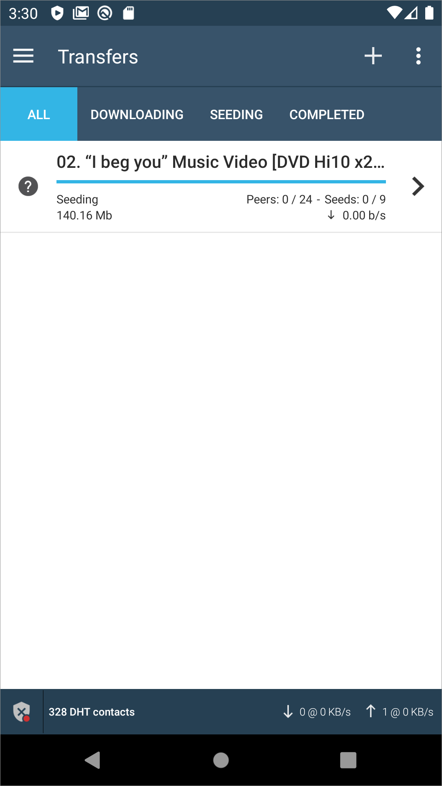
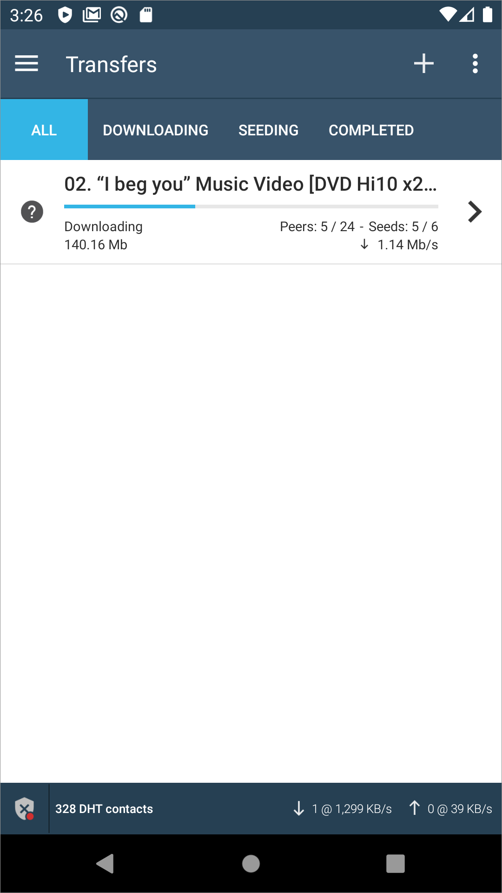
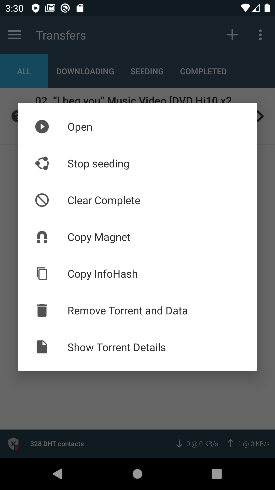

# FrostWire



## Setup

When first starting the FrostWire app, the user is not given the option to setup an account as in other P2P applications, especially those involving chat and messaging, but instead has to agree to legal terms about what files will be downloaded and shared over the P2P network.

### Download and Manage

The user can search the entire torrent network for files and can filter by media type.

To download the user simply clicks the download button and then confirms. There is also file size information given which would be very important to the mobile user.

After downloading, the file immediately starts seeding.

The file now being seeded also has user options with which the user can control the share.

!\[\]\[image-8\]

Finally, the user can manage all of their files from a download and share use. While most users may not dig this deep into the granularity of sharing over P2P, it is good practice that is included and the user has complete control over the share.

## Summary

* Relatively simple and solid torrent application that works well on mobile
* Android only
* Freemium model with the app ad-supported unless upgraded to a month by month, 6 month or yearly terms. Also has a 30 minutes free with 1 video ad play
* Useful for mobile downloads of music and video, but probably not for teams use and collaboration

\[image-8\]: ../../.gitbook/assets/frostwire-details.png

