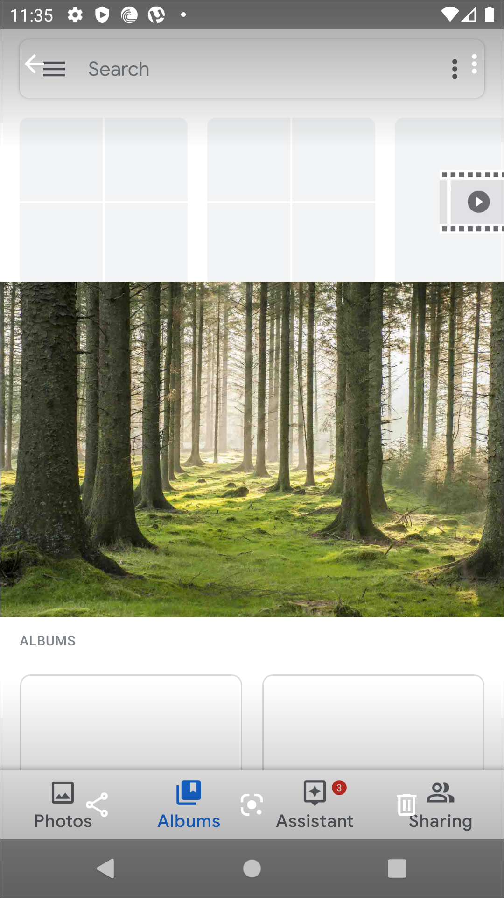
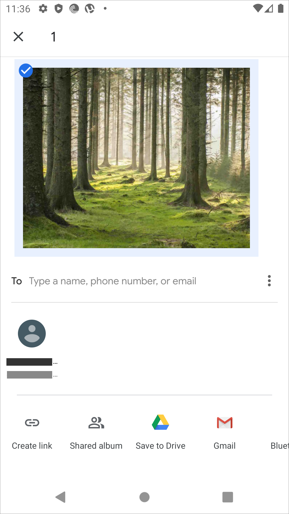
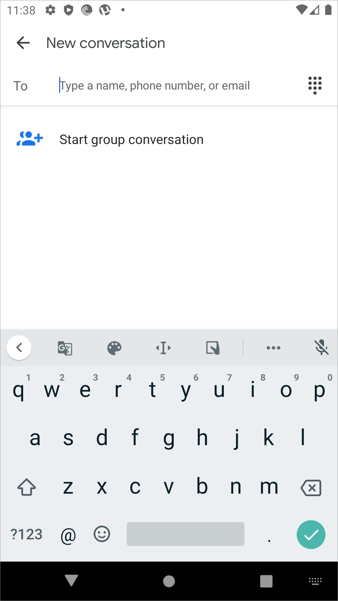
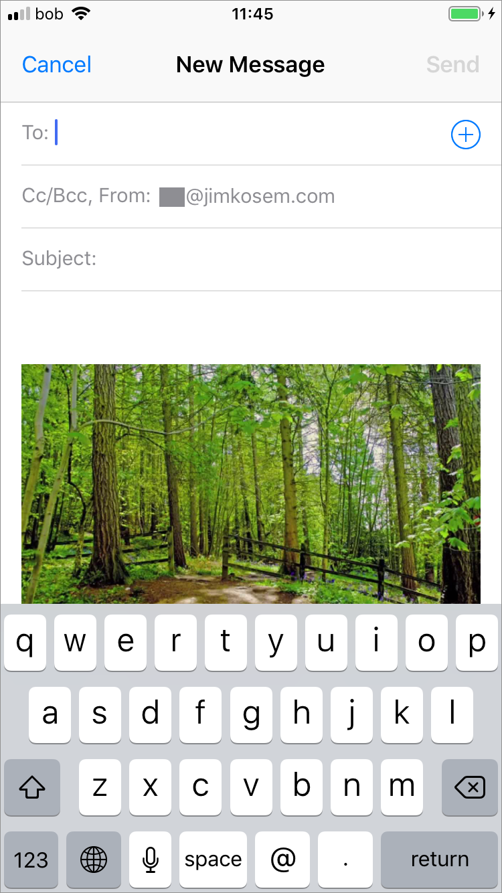
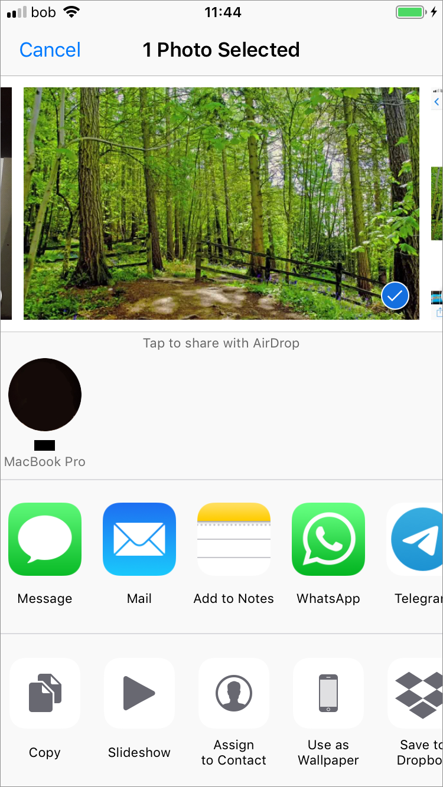

# Mobile Sharing Interaction Patterns

The most typical sharing and receiving interaction pattern on mobile devices is sharing photos. While sharing songs and videos is also common, it is usually not done by sending the actual file from device to device. Instead, it is typically done by using a messaging app to send a link to an audio or videos streaming service such as YouTube.

## Android

The user starts in the photo gallery to choose the photo they would like to share.

When the photo is selected it is opened in a light-box and the user has the options to share, use the Google Lens application to edit or add filters, and delete.

The user needs to access the contact either on the mobile device or stored in the Google cloud service.

When choosing to share, the user is given a number of options. Most interesting is the option to "type a name, phone number, or email" which means the user can use typeahead to find the contact and contact type quickly regardless of type. Frequently used contacts are shown which they can tap and send to directly. Alternately, they can select options such as "Create a link," "Shared album," etc., and using various messaging apps.

Android still features the ability to share directly via Bluetooth. This needs to be confirmed by first turning on Bluetooth if it isn't already, as well as pairing devices which differs from device to device.

The first screen the user encounters is a prompt to add to a shared album which would then be shared once created and then the user has to invite additional users to that shared album.

If the user shares with Messages, they are first prompted to first select an existing message. If there are none, the only other option is to create a new message or cancel.

After creating a message, which is perhaps the most common use pattern, they enter contacts, or can add a group.

## iOS

Like on Android, on iOS the most common sharing pattern starts with choosing a photo in the photo gallery app \(Photos\).

iOS, if connected or sharing a network with another Apple device, allows the user to send via AirDrop directly to that other device, in this case to a Mac laptop on the same network. If there is no Wifi network available, AirDrop can use "Bluetooth Low Energy \(BLE\) and Apple-created peer-to-peer Wi-Fi technology to send files and information to nearby devices" \([StackExchange](https://apple.stackexchange.com/questions/146644/airdrop-bluetooth-or-wi-fi)\).

iOS also provides a number of OS level options such as to copy or duplicate the file, Save to Files, Save to cloud services such as Dropbox, Print, etc. from the share menu as well.

Sharing through email is the most common default method of sharing as not all users may have the same messaging apps between them. In iOS as in Android it is very straightforward.

If the user chooses to send from the Share menu the photo via a messaging platform like WhatsApp, they need to first choose which user that they are already connected with they want to share with.

A WhatsApp photo share screen shows the photo that is being shared and the option to write a message in the text field and then the send button.

!\[\]\[image-16\]

Through the iOS default Messages app, the user sends the photo in the pattern of typeahead to choose contact and then adding the message in one screen.

## Summary

* Messaging is the primary method of sharing or sending files such as photos
* iOS and Android both share common patterns in how a user can share files on their mobile devices such as photos, which is find and select photo -&gt; choose messaging app -&gt; add contact -&gt; add message -&gt; send
* AirDrop is quite possibly the simplest sharing pattern with the fewest steps. This is facilitated with using devices of the some type \(Apple\) and already connected with each other. This means that each device has an ID already and the user clicks and it sends to them. It is also important to note, that the end user does not need to verify the sending of the photo meaning its seamless and just appears in the photos gallery.

\[image-16\]: ../.gitbook/assets/ios-sharing-9%20%281%29.png

