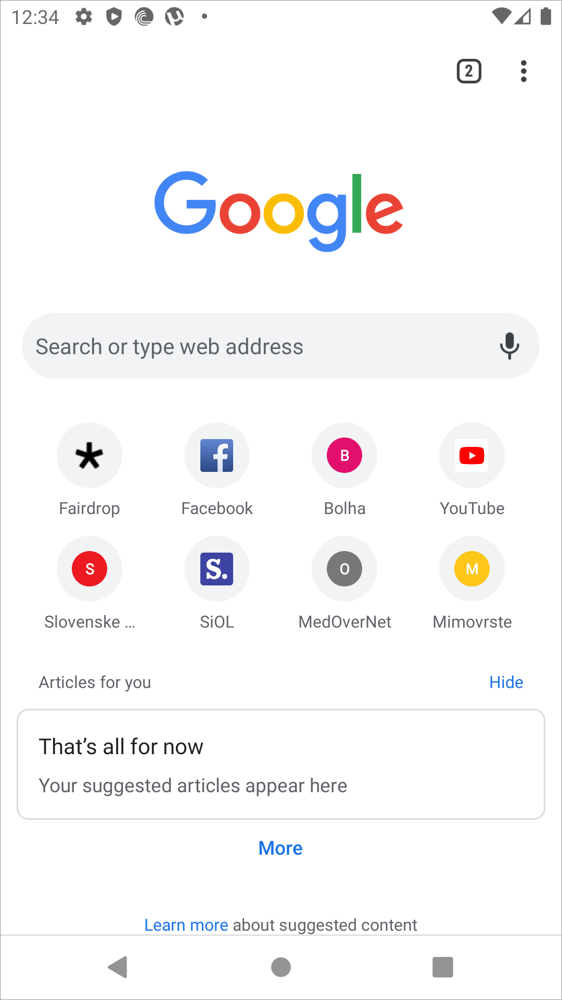
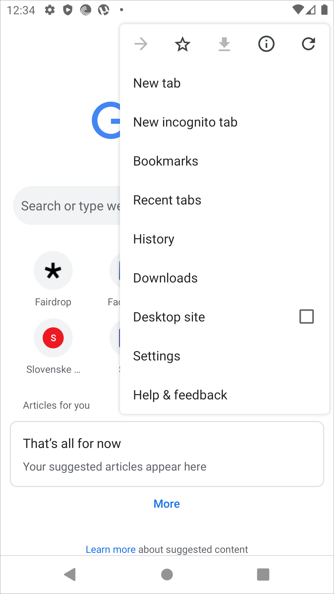
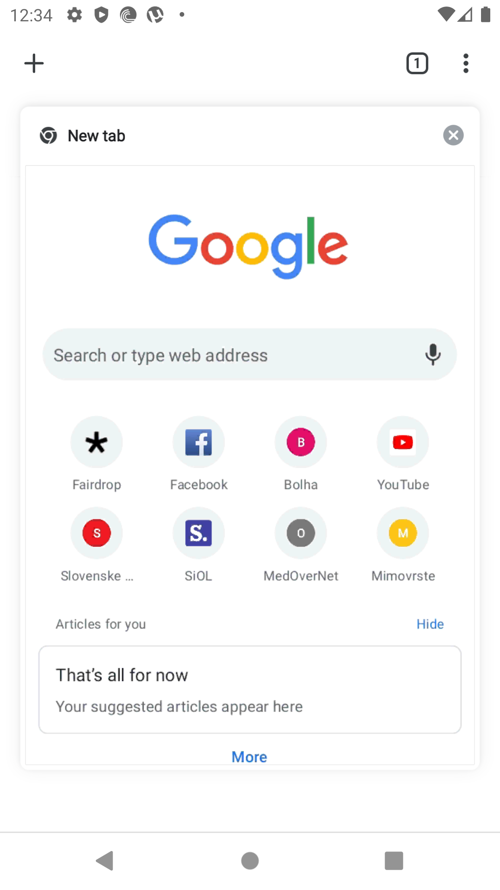
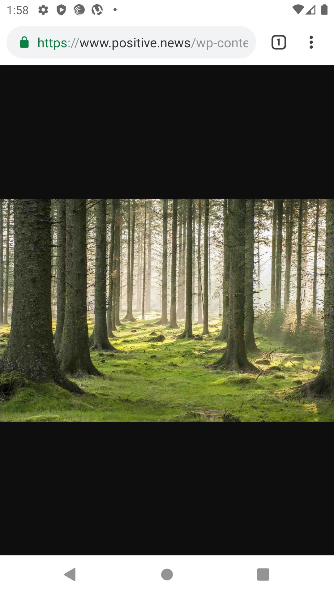
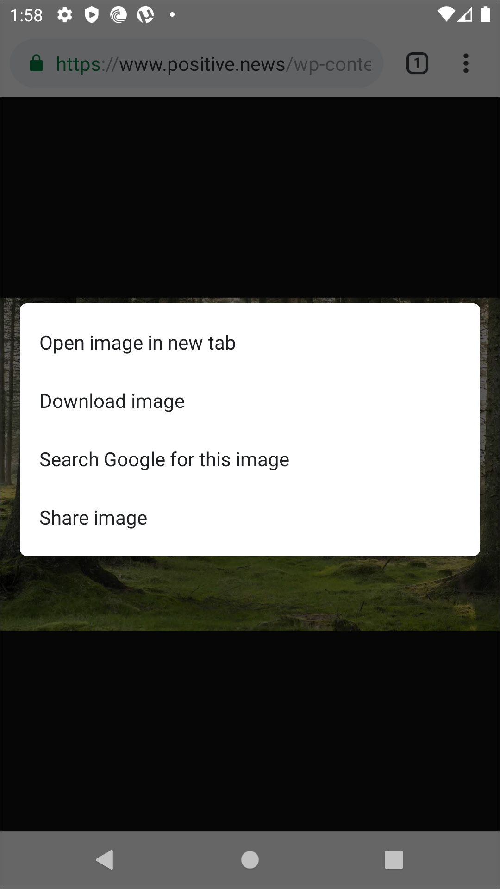
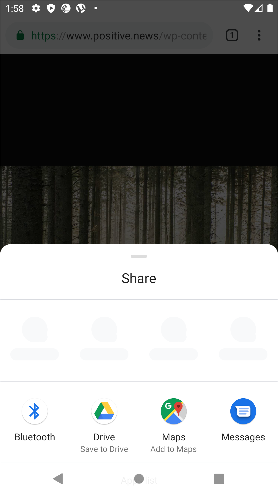

# Android

The default home screen for Chrome is populated with a number of frequently used sites and bookmarks, and the URL bar with a voice search option.

<table>
  <thead>
    <tr>
      <th style="text-align:left"></th>
      <th style="text-align:left"></th>
    </tr>
  </thead>
  <tbody>
    <tr>
      <td style="text-align:left">
        

        

          
        

      </td>
      <td style="text-align:left">
        

        

          
        

      </td>
    </tr>
  </tbody>
</table>The overflow menu on any Chrome tab has many options to navigate Chrome, but no support to extend it. Creating a new tab is accessed through the small button to the left of the overflow menu which shows the tabs together in shelf format.

If multiple tabs are open, in this case two, then the count and access is displayed next to the overflow menu.

A image displayed in Chrome from Google Search can be shared with a long press.

