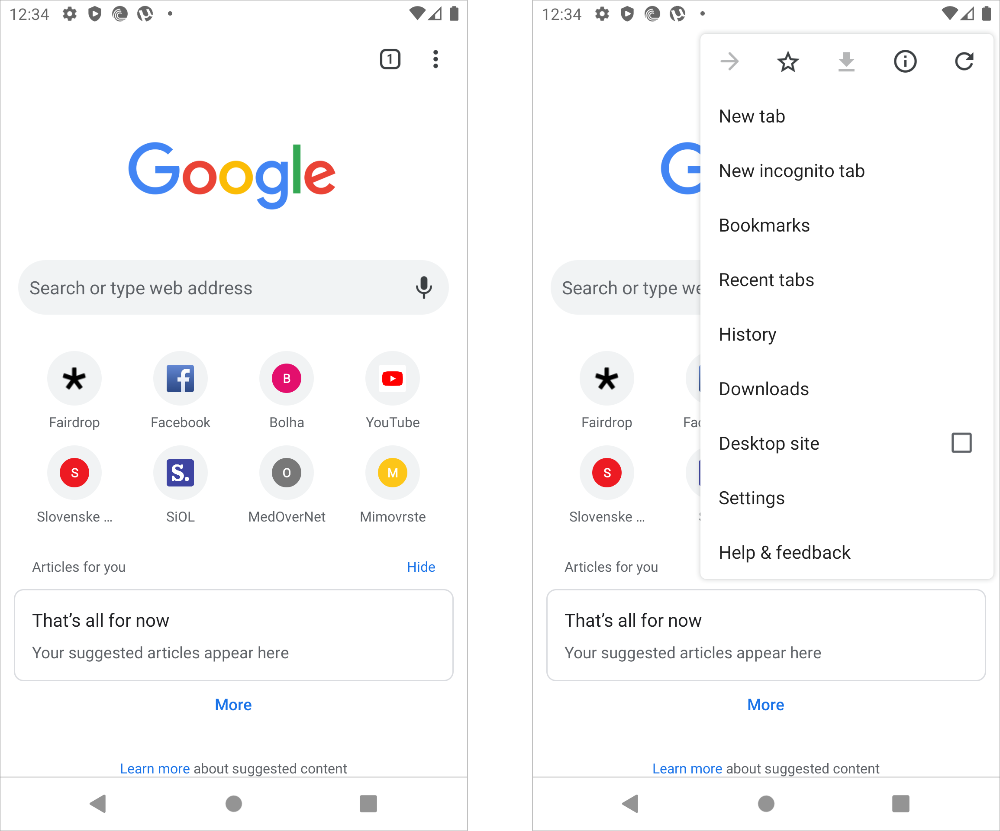
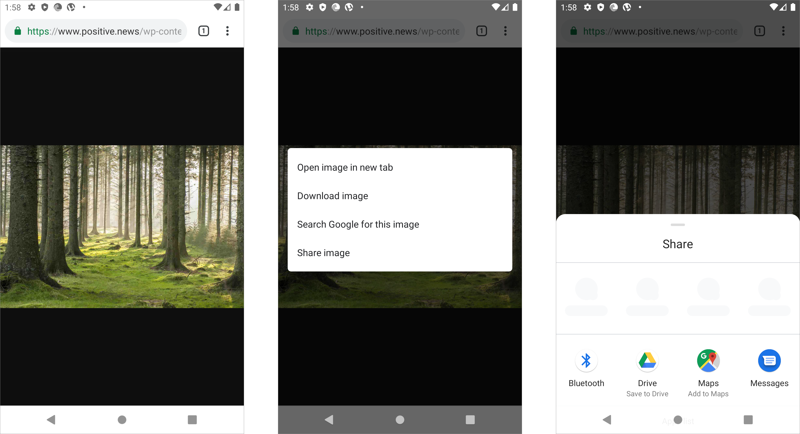

# Android Chrome

Frequently used sites, bookmarks, and the URL bar with a voice search option populate the default home screen for Chrome. The overflow menu on any Chrome tab has many options to navigate Chrome, but no support to extend it. This leaves designers and developers with no access to the browser itself but limits their creation of applications to web apps in the browser.

An image displayed in Chrome from Google Search can be shared with a long press, bringing up a menu the user can use to share the image directly from the browser. When selected brings up the bottom shelf menu, which then brings up all the sharing options common with other applications.

