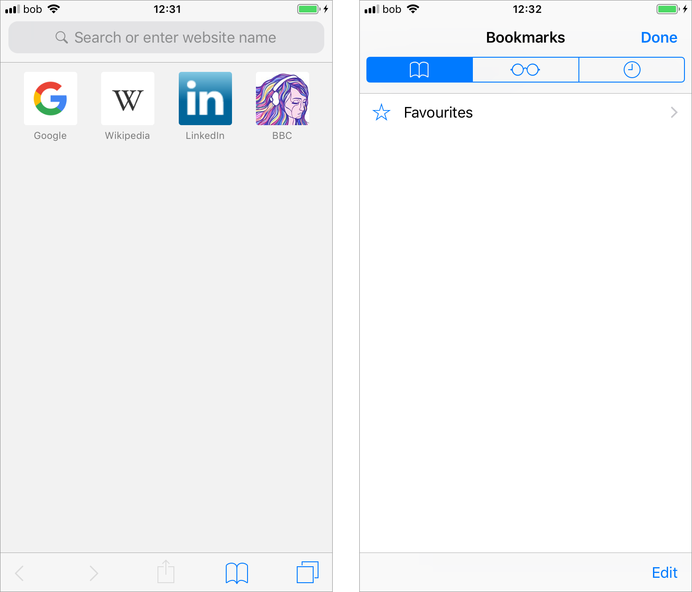
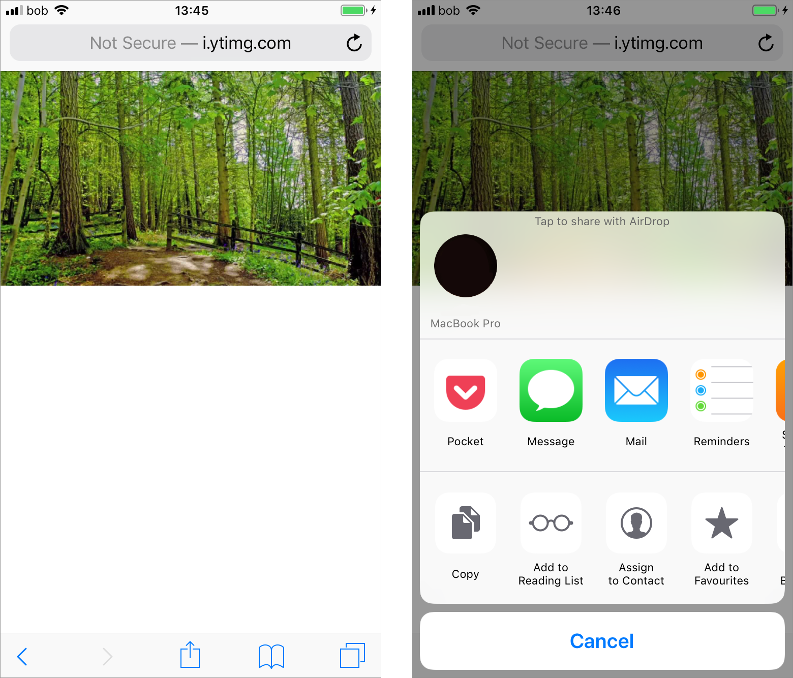

# iOS Safari

Safari on iOS shows the URL bar, a number of frequently visited sites and option bookmarks and nothing else beyond the reading list and tab controls on the bottom bar. Tabs are accessed and created through the tabs control.

Viewing an image gives no options for file management or manipulation except through the iOS share menu. There is no option to do anything with the file via the URL bar. Sharing of any file, loaded by URL in this case, can only be done by the OS level share menu, and to any installed app.

