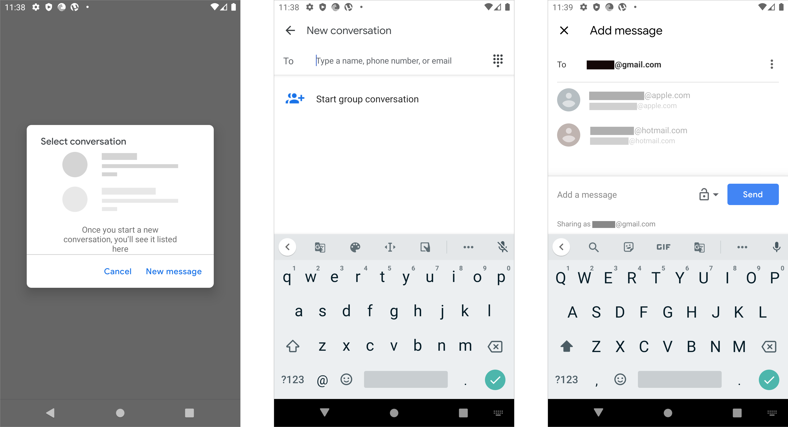

# Android sharing

The user starts in the photo gallery to choose the photo they would like to share.

‌When the photo is selected, it opens in a light-box, and the user has the options to share, use the Google Lens application to edit or add filters, and delete.

‌The user has several options when choosing the share. Most interesting is the option to "type a name, phone number, or email" which means the user can use typeahead to find the contact and contact type quickly regardless of type. Frequently used contacts are shown which they can tap and send to directly. Alternately, they can select options such as "Create a link," "Shared album," etc. and using various messaging apps.

Android still features the ability to share directly via Bluetooth. This needs to be confirmed by first turning on Bluetooth if it isn't already, as well as pairing devices which differ from device to device.

The first screen the user encounters is a prompt to add to a shared album which would then be shared once created and then the user has to invite additional users to that shared album.

If the user shares with Messages, they prompted to select an existing message. If there are none, the only other option is to create a new message or cancel. After creating a message, which is perhaps the most common use pattern, they enter contacts or can add a group.

