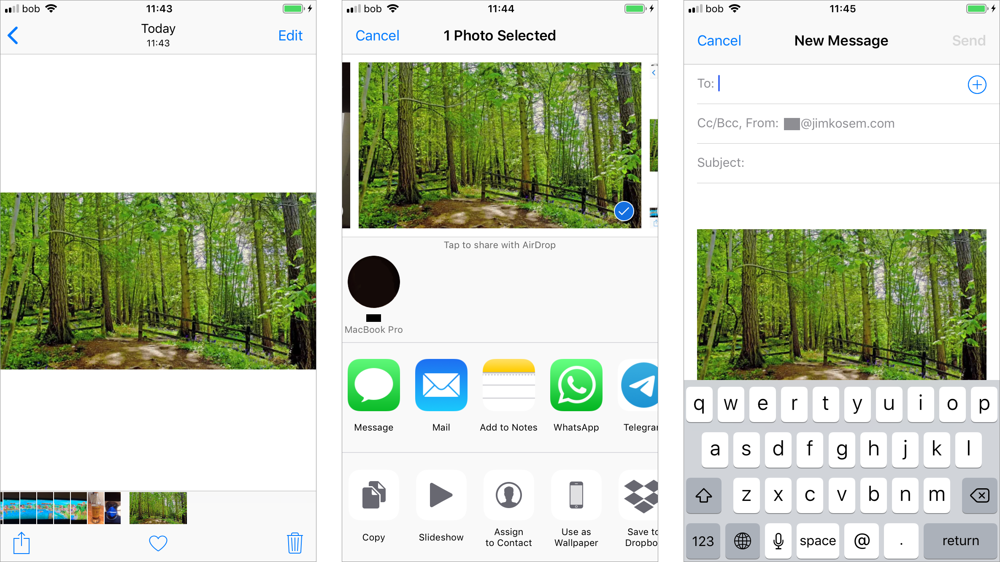
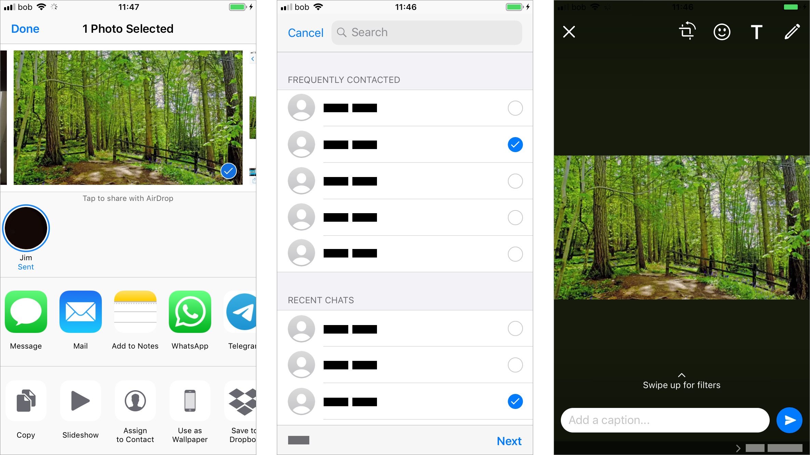

# iOS sharing

Like on Android, on iOS a prevalent sharing pattern with users starts with choosing a photo in the photo gallery app \(Photos\).

iOS, if connected or sharing a network with another Apple device, allows the user to send via AirDrop directly to that other device, in this case to a Mac laptop on the same network. If there is no wifi network available, AirDrop can use "Bluetooth Low Energy \(BLE\) and Apple-created peer-to-peer wifi technology to send files and information to nearby devices" \([StackExchange](https://apple.stackexchange.com/questions/146644/airdrop-bluetooth-or-wi-fi)\).

iOS also provides several OS level options such as to copy or duplicate the file, Save to Files, Save to cloud services such as Dropbox, Print, etc. from the share menu as well.

Sharing through email is a standard default method of sharing as not all users may have the same messaging apps between them. In iOS as in Android, it is very straightforward.

If the user chooses to send from the Share menu the photo via a messaging platform like WhatsApp, they need first to select which user that they are already connected with they want to share with.

‌A WhatsApp photo share screen shows the photo that is being shared and the option to write a message in the text field and then the send button.

‌Through the iOS default Messages app, the user sends the photo in the pattern of typeahead to choose a contact and then adding the message in one screen.

