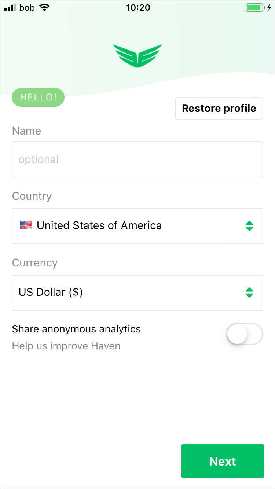
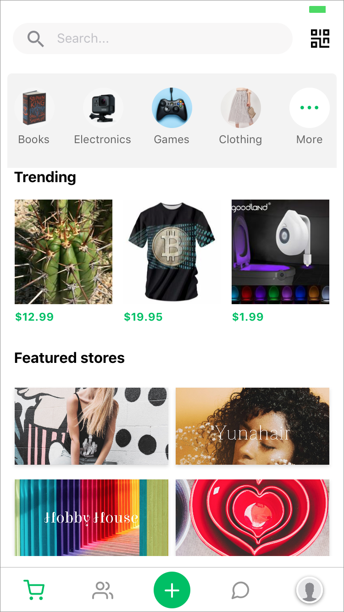
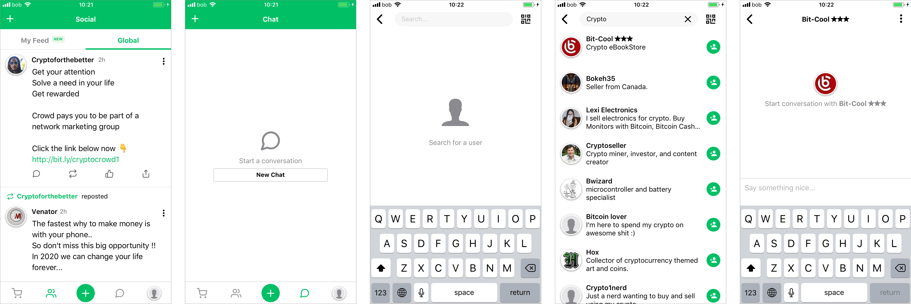
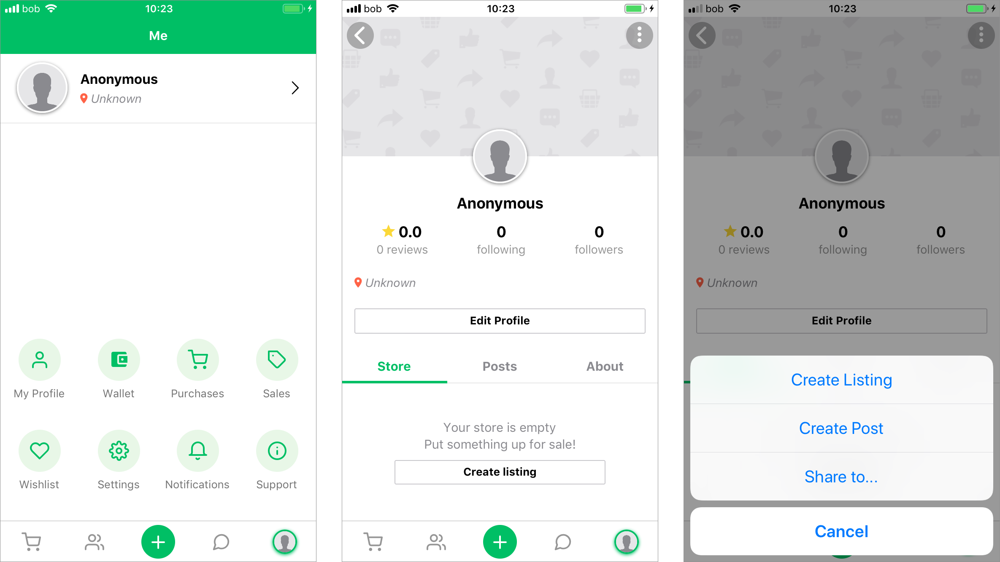

# Haven



> **More Privacy**
>
> The most private ecommerce application. We believe privacy is a universal right.
>
> **More Choices**
>
> A marketplace, social, private chat and a powerful cryptocurrency multi-wallet all in one place.
>
> **More Connection**
>
> Interact in a place where your data isn't being harvested. No fees. No data thieves.

[https://gethaven.app/blog/ipfs-in-action-haven-app/](https://gethaven.app/blog/ipfs-in-action-haven-app/)

> Haven is a mobile app that creates a private marketplace for users to exchange goods and services. Haven is built on top of a decentralized network called [OpenBazaar](https://openbazaar.org/), which is comprised of thousands of people around the world running free, open-source software that connects everyone peer-to-peer in order to buy new clothes, sell their music, or interact in the global marketplace however they choose.

> Haven harnesses the [Protocol Labs](https://protocol.ai/)’ InterPlanetary File System \(IPFS\), to solve a problem that hamstrung earlier versions of OpenBazaar. Because OpenBazaar is a peer-to-peer network, users had to run the software 24/7 for their stores to “stay open.” That’s a tall order for store owners. A few years ago, the OpenBazaar team started looking for a solution to this problem. They discovered IPFS and rebuilt OpenBazaar to use it. Today, OpenBazaar is one of the largest decentralized networks that use IPFS at its core.

## Onboarding

The user is first presented with either creating a new profile or restoring a previous one. When creating a profile, they need to include location and currency as the focus of this platform is shopping. At this point the user actually doesn't need to create a profile and can remain anonymous.

## Browsing and shopping

The default screen is the Shop screen where items can be chose to buy with crypto currency held within a wallet inside of Haven. Each of these items has a typical item screen showing a larger picture of the item for sale, its price in the chosen currency and cryptocurrencies as well as buying information.

The Floating Action Button \("+" in the Google Material pattern on the bottom app bar\) also has the main actions of the platform which is sell, post, chat and pay.

## Messaging

The Social screen shows feeds of other Haven users that are followed or the global feed of posts and activity. The Chat screen shows chats with other users that have to be already connected to or followed. Each user needs to be added individually by searching for other users.

## Identity and Setting

The user profile is shown and chat can be started without any invites or acceptances on the other user's part. Looking at the user's own profile, they can see that they are still anonymous and have a number of options and setting, as well as the ability to track purchases and sales and their cryptocurrency wallet. The Profile screen also provides the option to do much of what is done in the Haven store as well as create a more personal and less anonymous profile. Oddly, the user can create listings, posts and shares from the Profile screen just as they can from the Shop and Chat screens.

