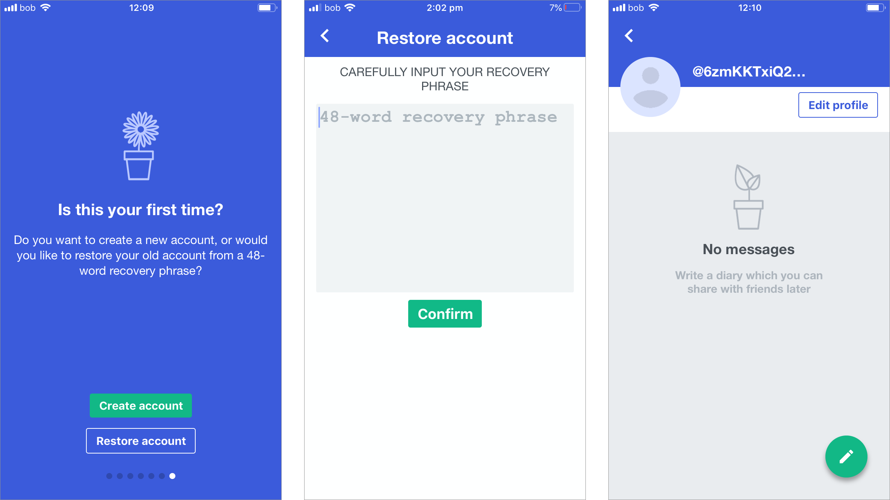
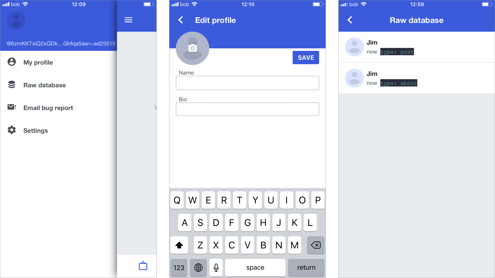

# ManyVerse



> Manyverse is a social network app using the SSB protocol \(Secure Scuttlebutt\) where you can write posts and share with friends nearby or over the internet. It's different from mainstream social networks because your data is yours, it lives on your phone, not in the cloud. So there is no login, no company holding your data, no ads, no tracking of your activity, it's just you and your friends! The app is free and open source software, and it will always remain free. \(iOS App Store\)

## Onboarding

The ManyVerse onboarding flow is thorough and explanatory, albeit a lot of reading for a new user.

When setting up the app for the first time the user encounters a typical pattern of setting up an account or restoring one. When a new account is setup however, there is no indication or notification that the account has been setup, nor of the profile that has been setup for them.

If the user would like to restore an account they need to enter in a 48 word recovery phrase. While this is no doubt highly secure, and despite essentially functioning like a password for the user, there could be other recovery options available.

Once a profile is created or recovered, the user then is presented with their profile screen which is a list of messages \(in this case blank as it's a new user\).

## Profile and settings

The default UI screen is the Messages screen where the user would compose and read messages they would receive once connected and synced via Scuttlebutt.

App navigation is handled by the navigation menu as is customary with the Google Material UI, which ManyVerse uses. The first accessible screen is the profile screen which doesn't provide any options outside of Name and Bio text fields and profile photo. Nothing in ManyVerse can be deleted, so when the user sees the database, there are no controls. The user can view the source code for each database entry by tapping the entry.

The Connections screen has a multitude of options to connect to other ManyVerse or Scuttlebutt users. To connect to another user, one needs to receive an invite to a "pub server" or be on the same Wifi network the user is currently on, via P2P or via a P2P pub server.

## Messaging

Messaging seems rather straight forward in ManyVerse, with a threaded view and Like and Comment buttons as well a colour scheme just like Facebook.

Upon clicking around the UI, I was somehow able to as a user to connect to myself on the Wifi network. At this point, I was also able to follow myself, which was unclear how this happened as well as what led me to this. There is a chance that while looking for pub servers on the Mac desktop Patchwork client that it somehow enabled this over the network, but for a novice absolutely nothing was clear. Also, there is an obvious usability problem in being able to connect to yourself, or having multiple identities running on the same app at the same time with no audit trail for the connections.

Viewing a user's profile and messages is rather straightforward, as is the ability to follow that user and view their bio.

