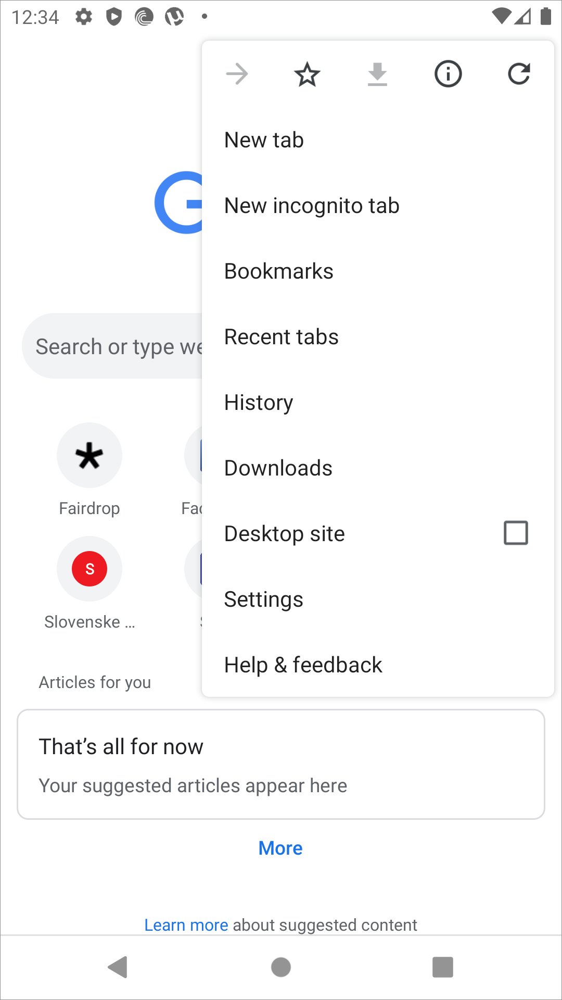
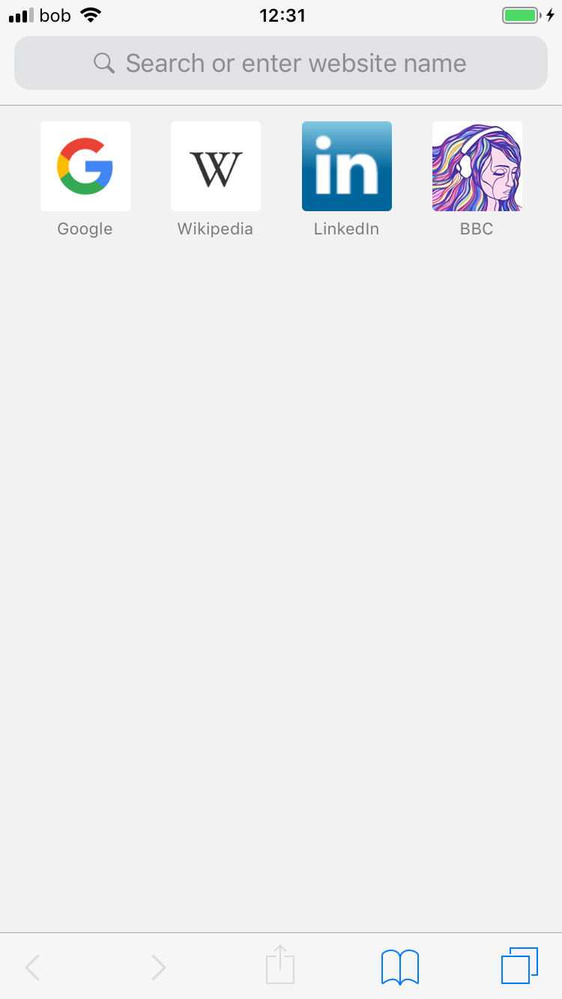
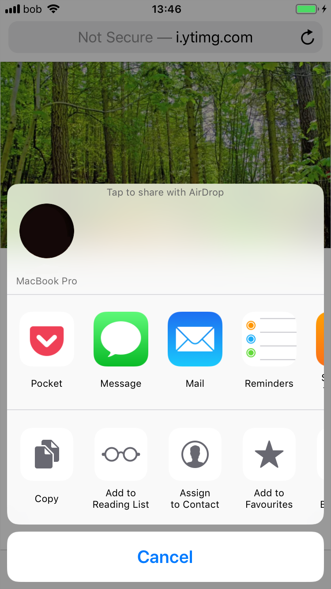

# Mobile Browser Survey

To investigate mobile P2P interaction for IPFS we first surveyed the two most prominent and widely used mobile browsers, Android's Chrome and iOS's Safari, both of which are the default browsers, and thus most likely to be used.

It is important to note that neither has support for extensions or add-ons, which would allow bringing the work directly to mobile, besides mobile interaction patterns being greatly different.

### Android

The default home screen for Chrome is populated with a number of frequently used sites and bookmarks, and the URL bar with a voice search option.

The overflow menu on any Chrome tab has many options to navigate Chrome, but no support to extend it.

Creating a new tab is accessed through the small button to the left of the overflow menu which shows the tabs together in shelf format.

If multiple tabs are open, in this case two, then the count and access is displayed next to the overflow menu.

A image displayed in Chrome from Google Search can be shared with a long press.

### iOS

Safari on iOS shows the URL bar, a number of frequently visited sites and option bookmarks and nothing else beyond the reading list and tab controls on the bottom bar. Tabs are accessed and created through the tabs control.

The only other controls in iOS Safari is for the user to access Favourites, Reading List and browser History.

Viewing an image gives no options for file management or manipulation except through the iOS share menu. There is no option to do anything with the file via the URL bar.

Sharing of any file, loaded by URL in this case, can only be done by the OS level share menu, and to any installed app.

