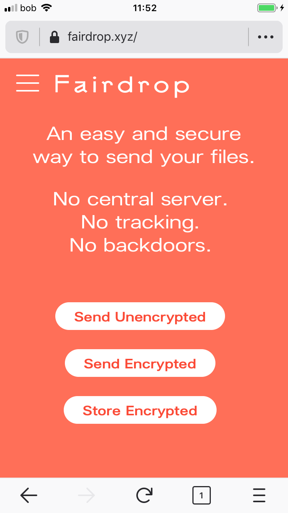
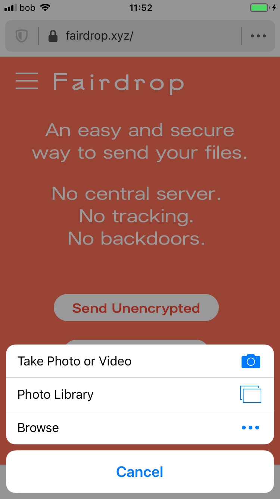
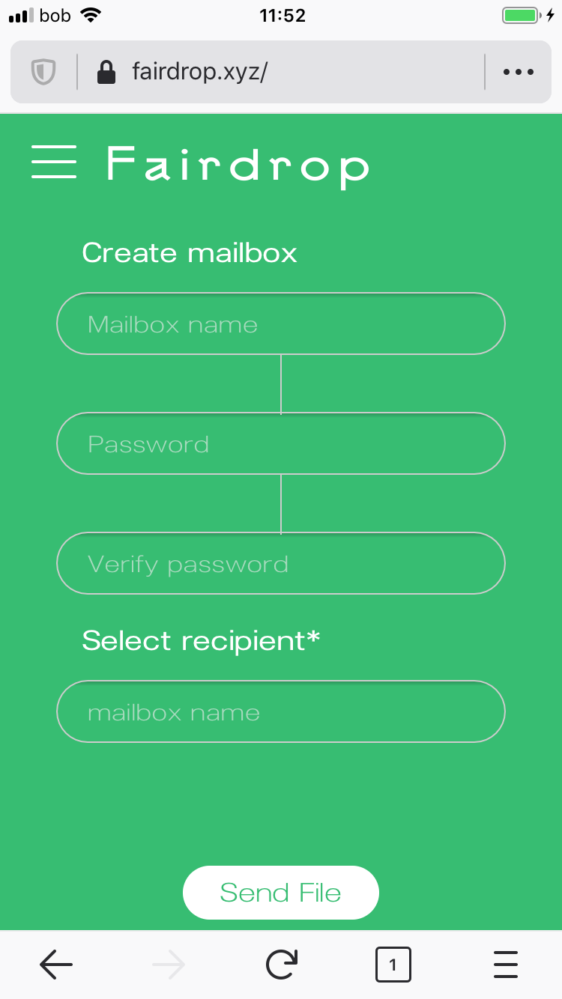
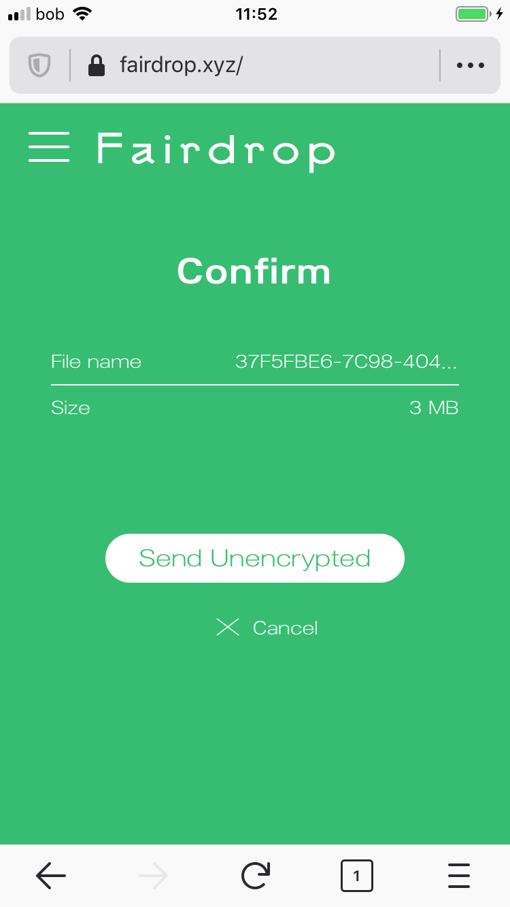
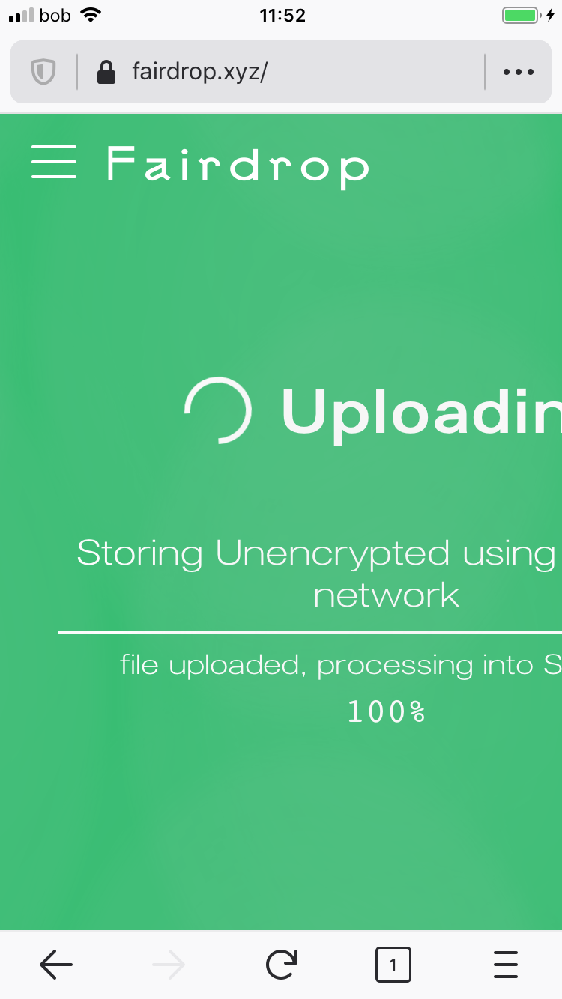
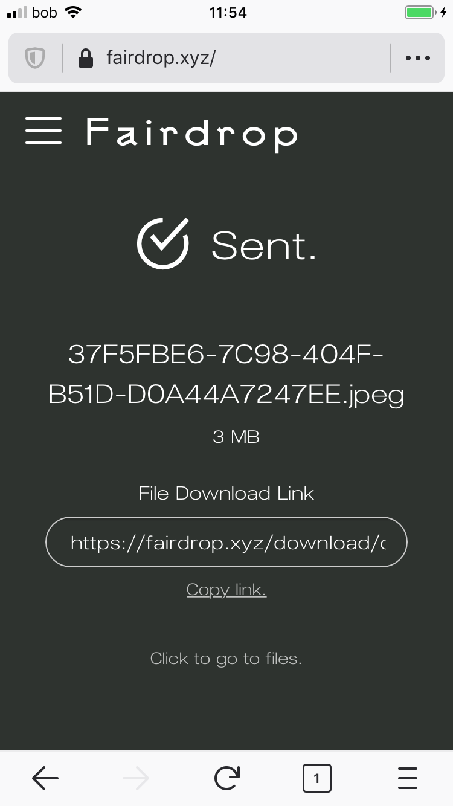
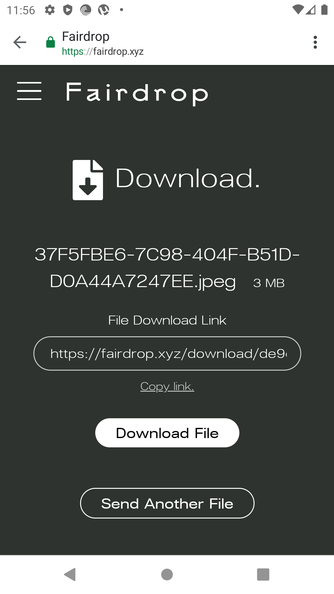

# Fairdrop



> An easy and secure way to send your files. No central server. No tracking. No backdoors.

### Sharing

Fairdrop is a web \(mobile and desktop\) app where the user can send files P2P either encrypted or unencrypted.

After choosing to send the file unencrypted the user needs to choose the file on the device they are sharing from.

If the user choose the ecrypted method of file transfer, they need to create a mailbox which requires an account.

The user loads the file from their device \(using Firefox iOS\) which shows the confirmation screen showing the file hash, it's file size and then the option to send or cancel the send.

Uploading progress screen

The user sees the confirmation screen on their device and the link for the other user to download the file. That can be done by copy/pasting the link and then sending it through whichever method they choose.

The other user opens that link in a browser \(Chrome, Android\) and they see the file options to download that file.

The file can be viewed or downloaded to the device.

### Summary

* Simple method of interaction
* It is not clear what is involved with accounts and signup for accounts without the user going through the process
* Does not give the user an option to use OS level integrated method \(SMS, email, etc.\) to send the link once the file is sent

