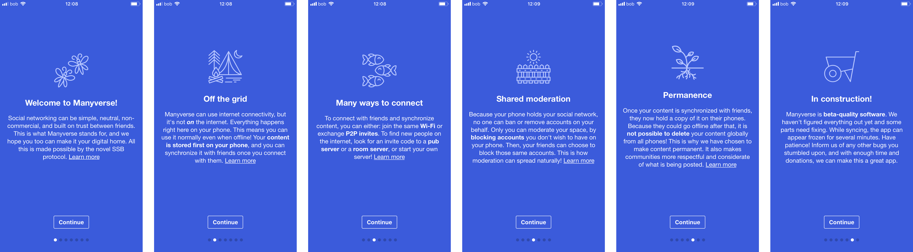
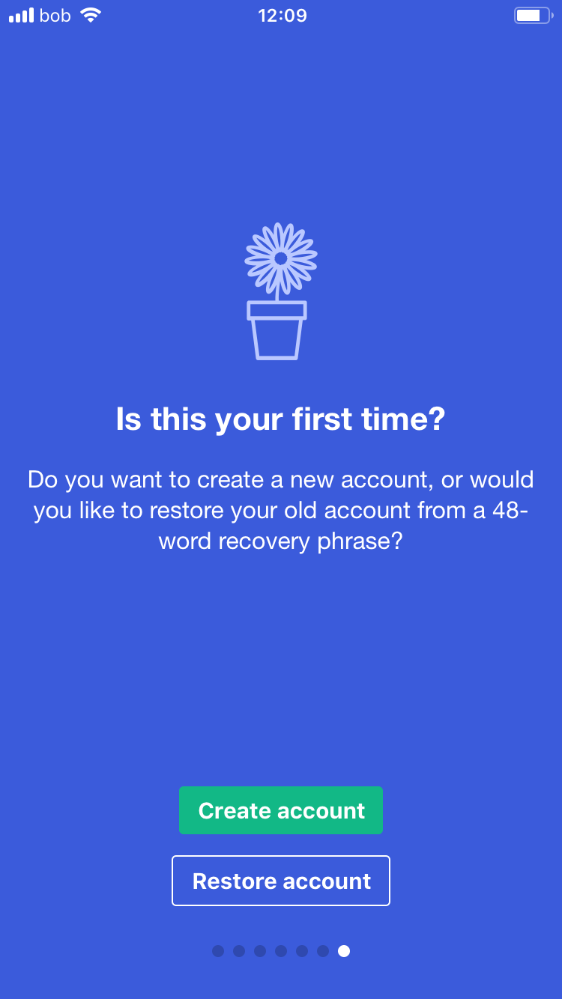

# Manyverse



> Manyverse is a social network app using the SSB protocol \(Secure Scuttlebutt\) where you can write posts and share with friends nearby or over the internet. It's different from mainstream social networks because your data is yours, it lives on your phone, not in the cloud. So there is no login, no company holding your data, no ads, no tracking of your activity, it's just you and your friends! The app is free and open source software, and it will always remain free. \(iOS App Store\)

### Onboarding

The ManyVerse onboarding flow is thorough and explanatory, albeit a lot of reading for a new user.

When setting up the app for the first time the user encounters a normal pattern of setting up an account or restoring one.

When a new account is setup however, there is no indication or notifaction that the account has been setup, nor of the profile that has been setup for them.

If the user would like to restore an account they need to enter in a not terribly friendly 48 word recovery phrase. While this is no doubt highly secure, and despite essentially functioning like a password for the user, there could be other recovery options available.

### Profile and settings

### 

### 

