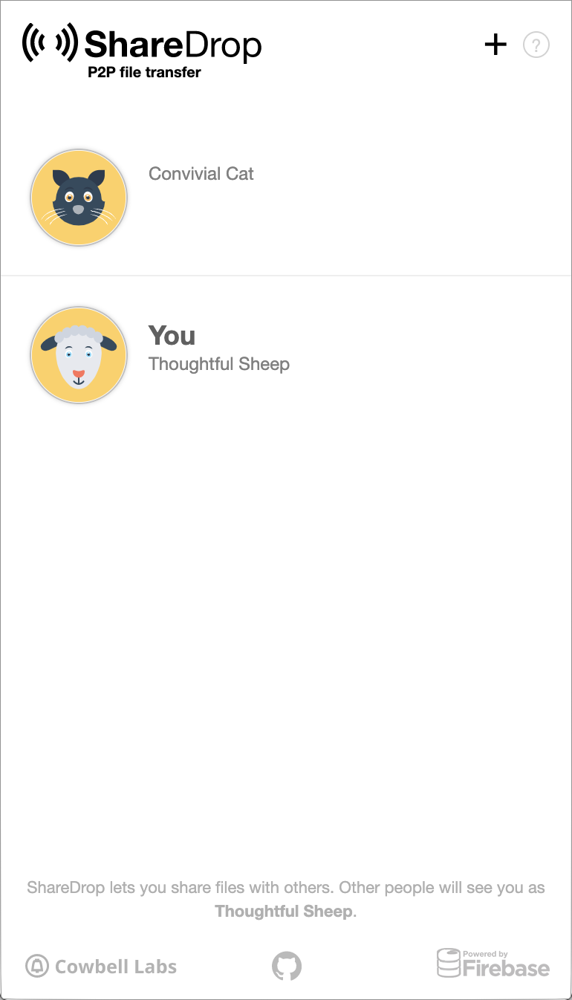
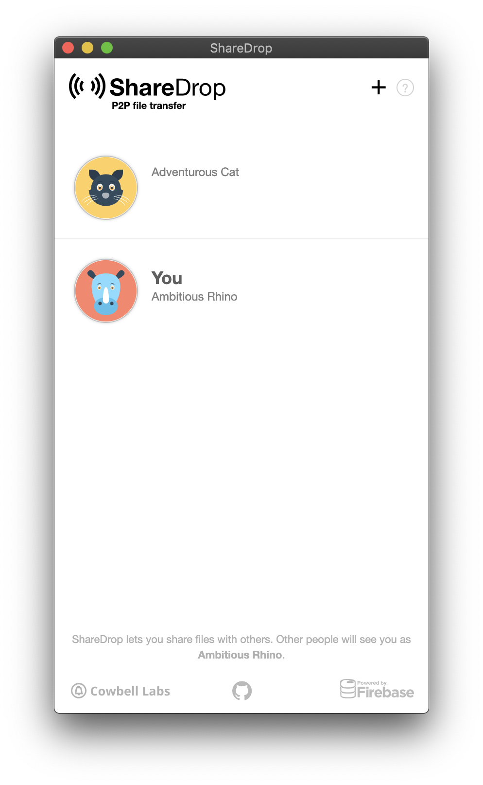

# Sharedrop.io



> **ShareDrop** is a peer-to-peer file sharing app powered by HTML5 WebRTC.

ShareDrop is a web application that also works on mobile. For testing purposes, it seemed to work in this case on Brave \(desktop/mobile\) and Safari \(mobile\). It had worked previously on Firefox \(desktop/mobile\) but that was not working for this particular testing.

The user is prompted with a modal showing how to use the app.

On the sharing mobile \(in this case, desktop simulation in Brave\) any user with SharePoint open on the network shows as an animal avatar. In this case, showing the two test devices.

