# Status



> Status is a private and secure communication tool. Chat with friends, store crypto and explore the future of the web without being exploited for your data.
>
> With Status, you alone control your information.
>
> CHAT
>
> Status chat is peer-to-peer. Not only is your message content protected, but so is your metadata. The ultimate in privacy protection from a messenger.
>
> TRANSACT
>
> Store digital assets in your Status wallet. Send and request tokens from friends, or transact with decentralized applications.
>
> EXPLORE
>
> Access Ethereum based applications on web3. Play games, exchange digital assets and more.

## Onboarding

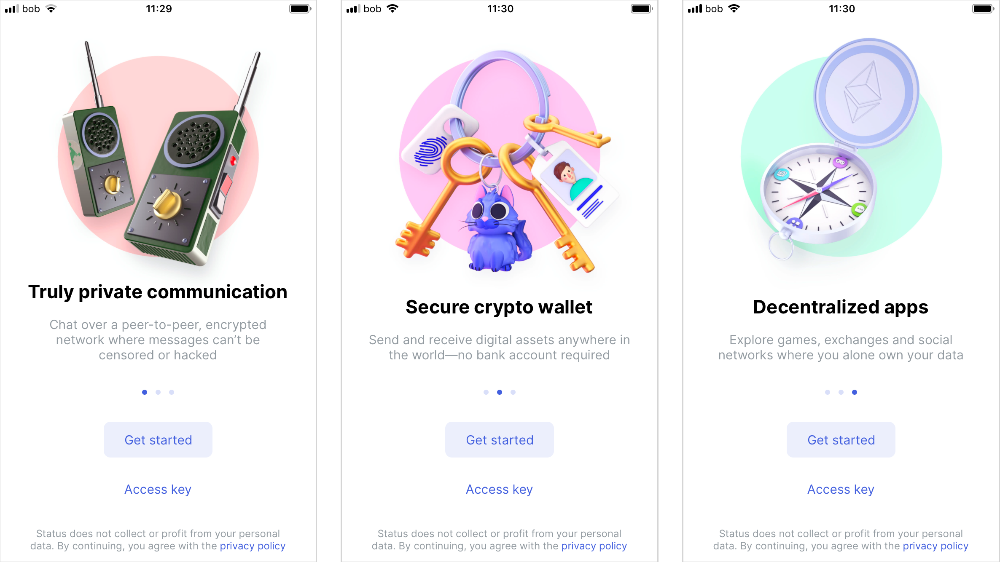

As most apps, especially messaging and transactional apps involving accounts, Status has a three screen onboarding intro explaining to the user in a terse and uncomplicated manner what they will be doing in signing up and using the app.

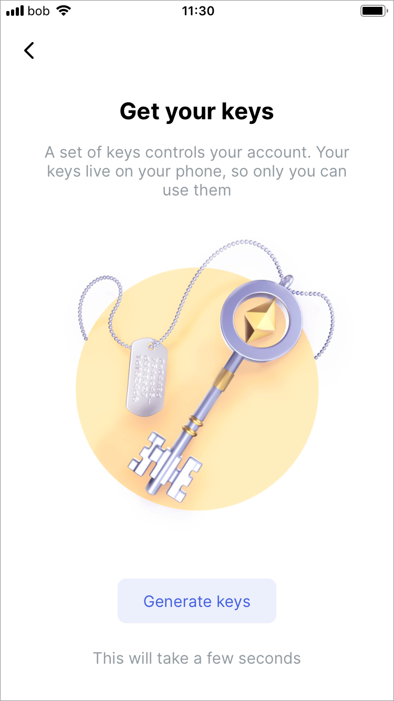

As this uses blockchain technologies, there are sets of keys, public and private involved, meaning the user needs to then be aware of this to access their account, but could lead to confusion with novice users unused to this.

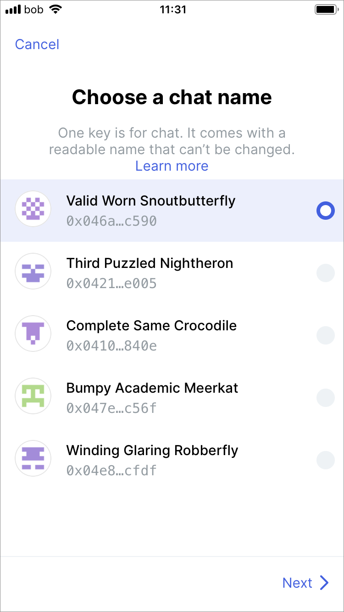

The user needs to choose a chat name which it will default to. This can be changed later.

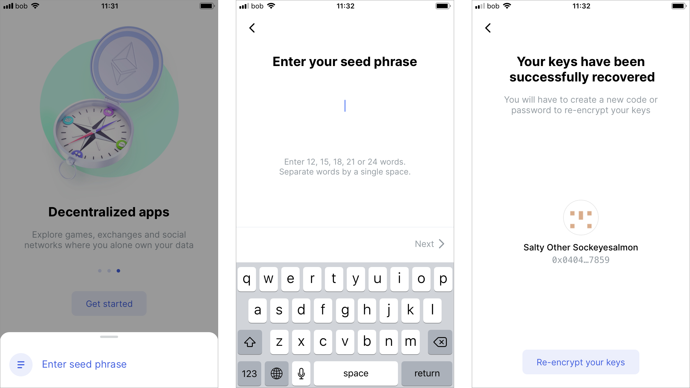

Recovering keys is a long winded process for most non-blockchain users where they need to enter in a seed phrase which is a string of 12 or more words. Again, not very usual or useful for the uninitiated, but a common pattern in blockchain \(d\)apps.

Whether recovering keys for a previously established account or creating a new one, a new password has to be set.

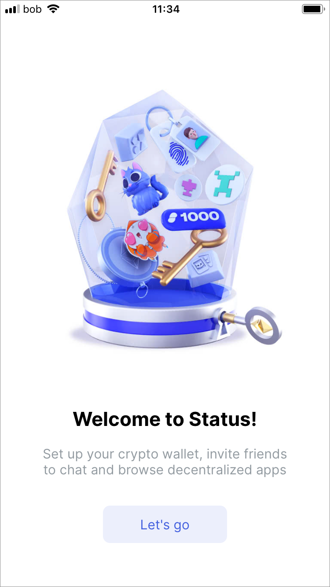

Typical welcome screen showing setup is done.

### Messaging

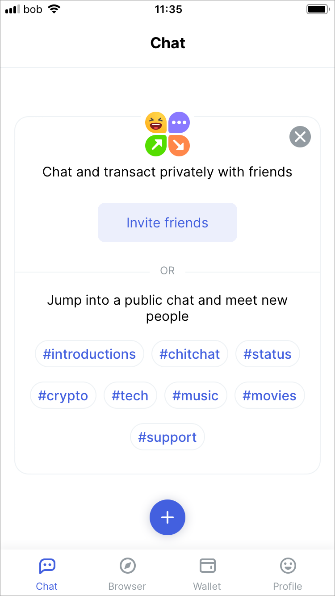

The main navigation features the main modes of Status \(Chat, Browser, Wallet and Profile\), the first of which is the Chat.

> Whisper uses peer-to-peer dark routing–making it impossible for anyone \(including us\) to know anything about you or who you're communicating with. We plan to improve Whisper with a fork of the protocol called Waku which is being developed by the Vac team.

Inviting people to chat is not a typical process and involves not discovery of existing users that the user might already have a phone number or email of in their Contacts application \(common on chat programs such as WhatsApp and Telegram\) but instead an invite has to be sent through the OS to the person to be invited.

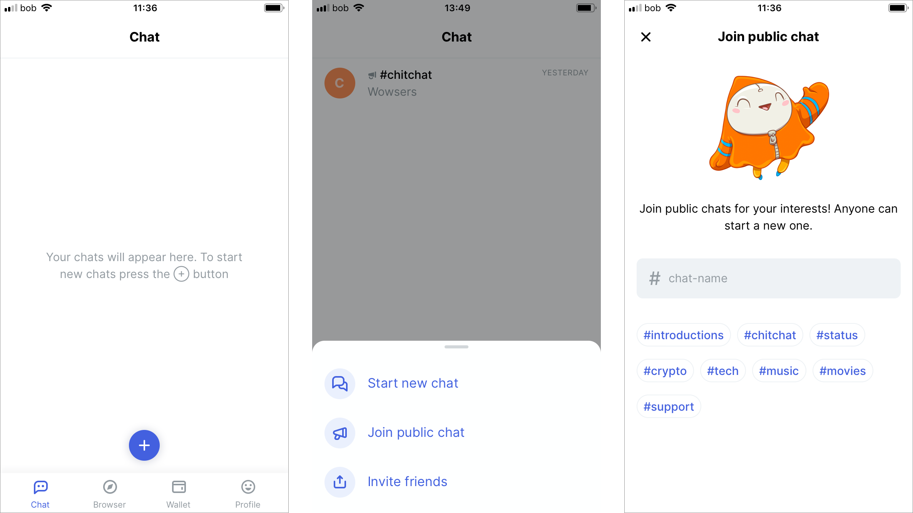

To start a secure P2P message, or join a conversation, the user needs choose which they want to do through the pull-up shelf options. If joining a public chat they have a number of rooms that they can choose from. The user can also start a new room with by typing the name into the text field.

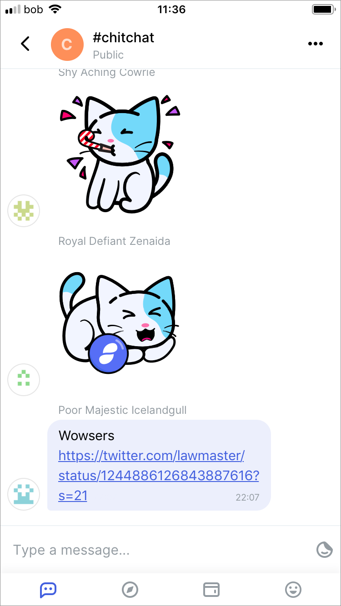

The chat screen is typical of any chat program and follows the same interaction patterns and conventions, along with the ability to add stickers to the chat thread.

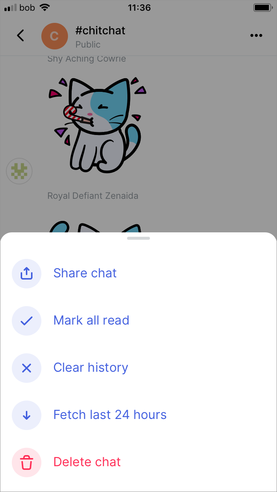

There are a couple additional non-typical chat features, namely being able to delete and fetch.

## Browser

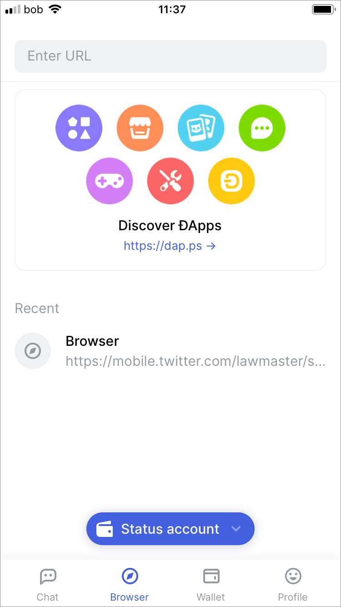

The Status browser allows the user to use decentralised applications \(dApps\) which allows transactions to happen natively within the browser.

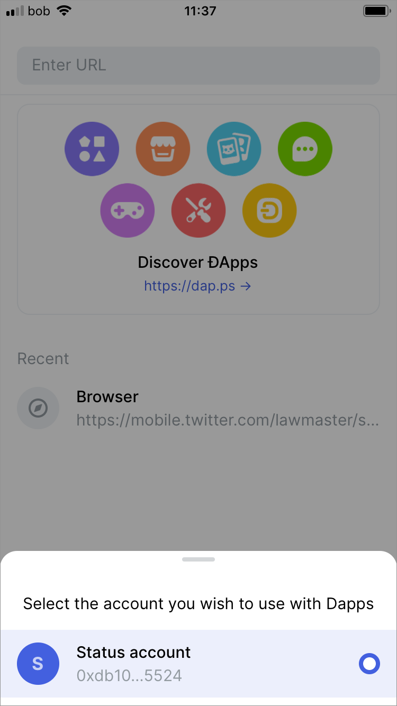

An account for the crypto currency transactions needs to be enabled.

!\[\]\[image-15\]

The signing phrase adds an additional level of security when using the wallet within the dApp browser.

## Summary

* Solid and user friendly blockchain app which enables relatively inexperienced users to get started with blockchain dApps
* While the sign-on process is typical and smooth for a blockchain app, it might be confusing to those who just wish to use P2P without public and private keys and maintaining them
* Chat is solid and user friendly and has discoverability as well
* Any transferring of files can only take place with a loaded dApp in the Browser, meaning Status does not have file transfer functionality built in
* Might benefit from allowing users to share things directly through a native function or perhaps through Chat.

\[image-15\]: ../../.gitbook/assets/status-screen-22.PNG

