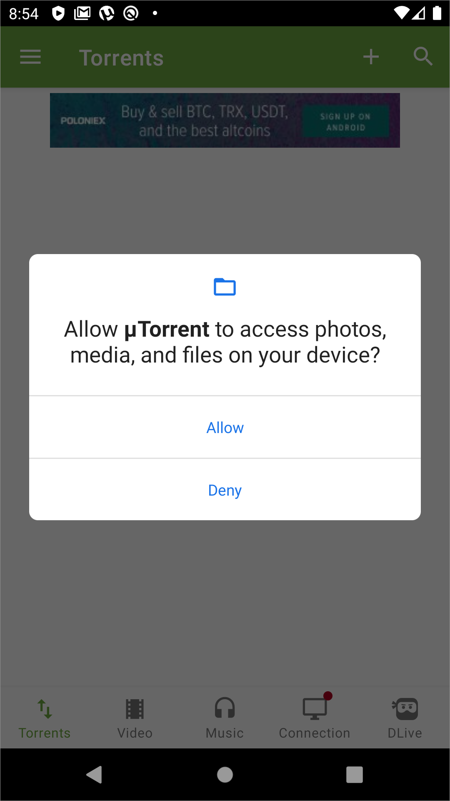
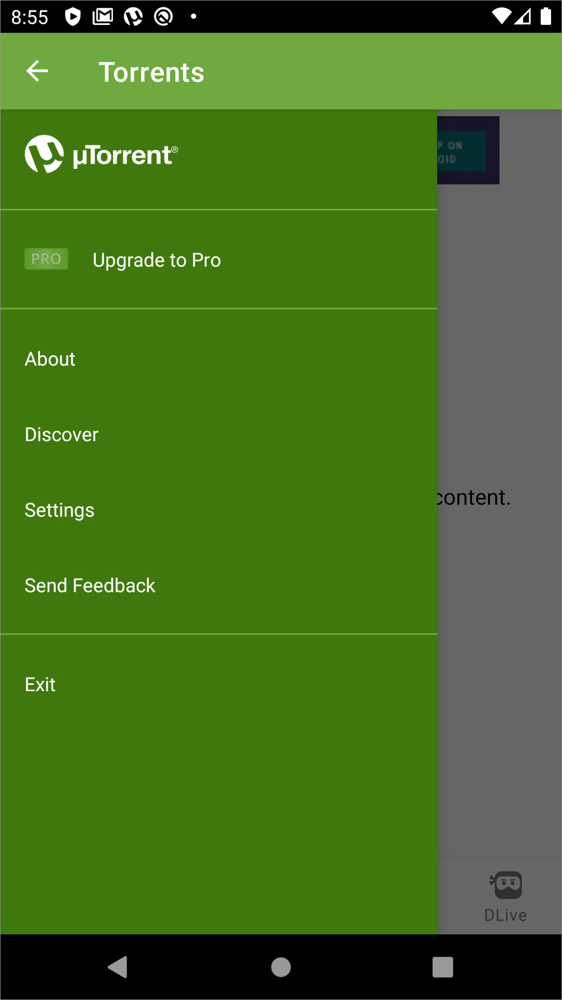
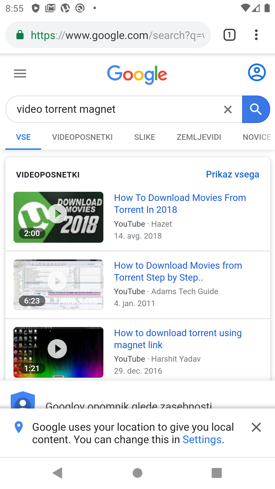
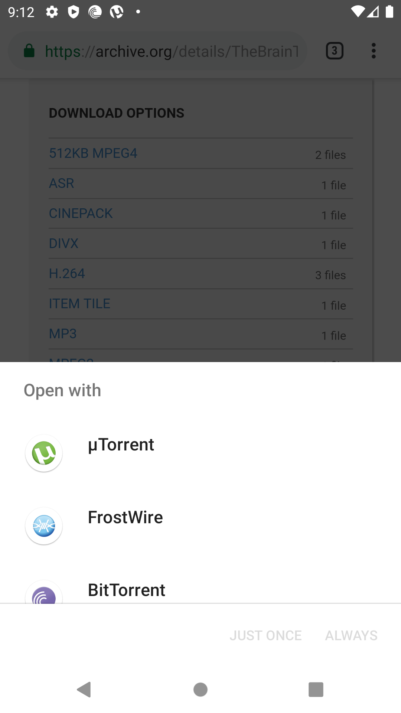
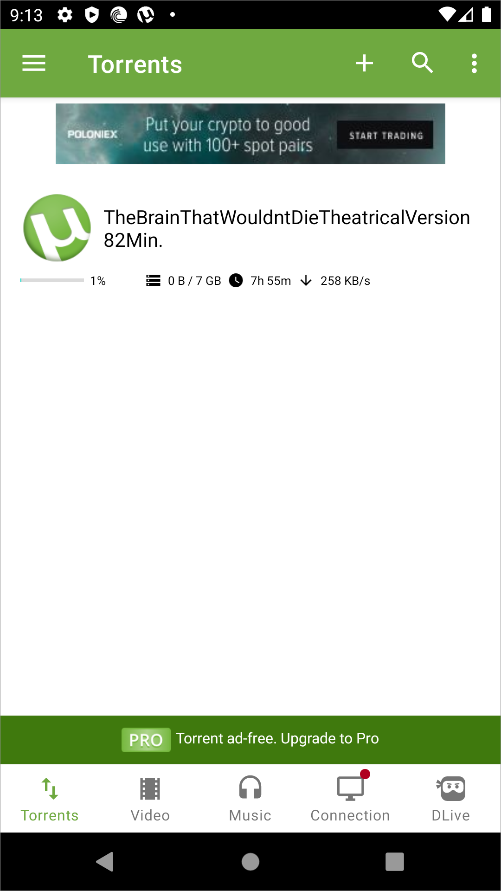
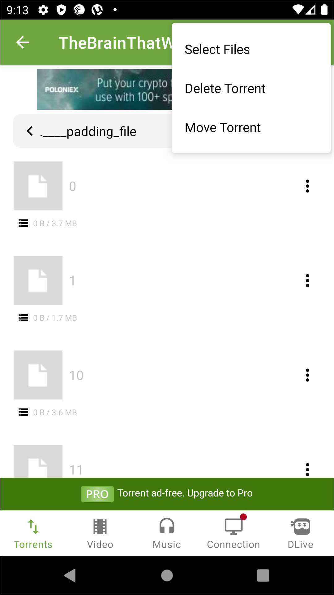

# uTorrent Mobile



> **Search**
>
> Use your browser to find torrent files and magnet links. 
>
> **Download**
>
> Open these files and links in uTorrent Mobile to quickly and efficiently download your torrents. 
>
> **Enjoy**
>
> Easily play back your music and audio files using the integrated media player.

### Setup

Setup is instant when installing the Android app and immediately goes to a confirmation screen to acces local media.

The main navigation features prominently the option to upgrade to the paid version.

### Download

The Search option in the upper global navigation opens a dialogue which the user would assume searches for torrents in the app.

Instead, Search opens a Google search of the search string entered in the dialogue.

If there are any torrent clients installed on the Android device, a system dialogue opens that link in choice of apps on the device.

The Torrents screen shows the torrent downloading and the pertinent info.

When the user selects the torrent, all of the files are displayed.

When managing any of the torrent shares with the options menu, the user can select the files comprising the torrent, delete it or move the torrent.

### Summary

* Simple torrenting app which seems at the outset as simple enough to use
* Search is not integrated into the app, but instead is overall very user unfriendly use of an intergrated browser doing blanket search
* Downloading isn't consistent and sometimes requires the user to copy and paste the torrent link and then add through the app manually
* The main navigation on the bottom is misleading as the Video and Music links do not search for or list Video and Music, but are filters for local files
* DLive is featured in the main, bottom navigation but is not an integrated feature that allows downloading or sharing of files but a live video stream site which features no torrent downloading or sharing

